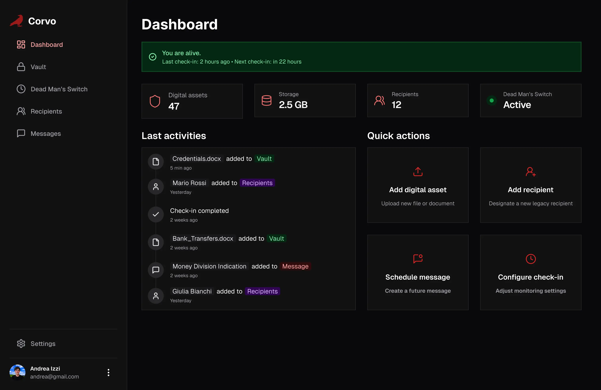

# Corvo

Corvo is an open-source, self-hosted digital legacy management platform. It helps users securely store important information and ensures their final wishes are carried out after their passing. Unlike commercial alternatives, Corvo gives you complete control over your data by running on your own infrastructure.

This project is currently under active development.



## Key Features

* **Digital Vault:** Securely store documents, images, credentials, and notes with client-side encryption.
* **Dead Man's Switch:** An automated check-in system that triggers information distribution if you become incapacitated.
* **Recipient Management:** Designate trusted individuals to receive your digital assets with granular access controls.
* **Self-Hosted:** Maintain complete ownership and privacy of your data by hosting Corvo on your own server.
* **End-to-End Encryption:** Your data is encrypted on your device before being sent to the server, ensuring maximum security.

## Tech Stack

Corvo is built with the T3 Stack, which includes:

* Next.js (with TypeScript)
* tRPC
* ChakraUI
* Drizzle ORM
* PostgreSQL
* NextAuth.js

## Getting Started

To get a local copy up and running, follow these simple steps.

### Prerequisites

* Node.js
* npm
* Docker

### Installation

1. **Clone the repo**
   **Bash**

   ```
   git clone https://github.com/andreaizzi/corvo.git
   ```
2. **Install NPM packages**
   **Bash**

   ```
   npm install
   ```
3. **Set up environment variables**
   Create a `.env` file and add the necessary environment variables (see `.env.example`).
4. **Run the development server**
   **Bash**

   ```
   npm run dev
   ```

## Roadmap

See the [open issues](https://www.google.com/search?q=https://github.com/andreaizzi/corvo/issues) for a list of proposed features (and known issues). View our [roadmap](https://www.google.com/search?q=./corvo-roadmap.md) to see the future direction of the project.

## Contributing

Contributions are what make the open-source community such an amazing place to learn, inspire, and create. Any contributions you make are  **greatly appreciated** .

1. Fork the Project
2. Create your Feature Branch (`git checkout -b feature/AmazingFeature`)
3. Commit your Changes (`git commit -m 'Add some AmazingFeature'`)
4. Push to the Branch (`git push origin feature/AmazingFeature`)
5. Open a Pull Request

## License

Distributed under the MIT License. See `LICENSE` for more information.
